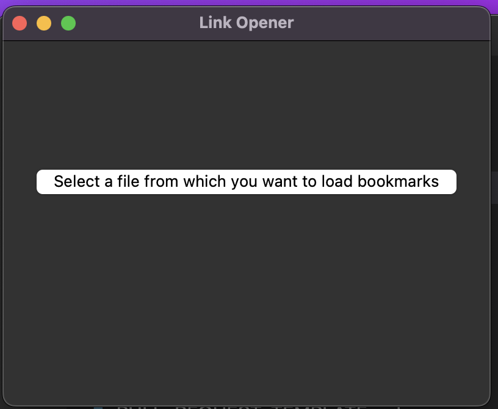

# Link Opener

A script that opens a file containing URLs and opens each one in a new tab in your default web browser.
Getting Started

These instructions will get you a copy of the script up and running on your local machine.
Prerequisites

The script requires the following dependencies:

    Python 3.x
    tkinter
    webbrowser

# Installing

You can install the required dependencies by running the following command:

`# pip3 install webbrowser`
`# brew install python-tk`

## Running the script

To run the script, follow these steps:

    Save a text file with one URL per line.
    Run the script using the following command:

$ python link_opener.py
It will load the window and then you can select the path to your file.

The script will open each URL in a new tab in your default web browser.
Built With

    Python - The programming language used
    tkinter - GUI toolkit
    webbrowser - Module for displaying web-based documents to users

# Sample screenshot

